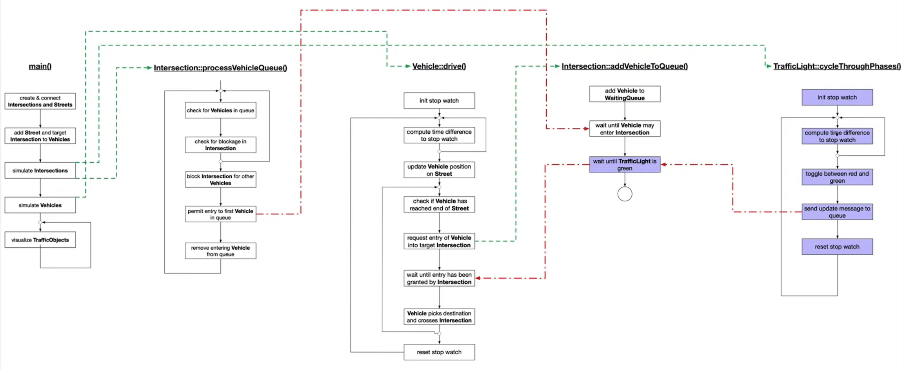

# Concurrent Traffic Simulation


A multi-threaded traffic simulation built with C++ demonstrating concurrent programming concepts. Vehicles navigate through a city with traffic lights using thread-safe communication.


## Features

- **Traffic Lights** - Each intersection has red/green cycling lights
- **Thread-Safe Messaging** - Vehicles and lights communicate via message queues
- **Concurrent Execution** - Each vehicle and light runs in its own thread
- **Mutex Protection** - Shared resources protected from race conditions
- **Condition Variables** - Vehicles wait for green lights efficiently
- **Async Operations** - Light phase changes use std::async

## Architecture



## Demo

[Watch the simulation in action →](https://www.youtube.com/watch?v=3Cddvt0tG_Y)

## Project Structure

```
├── src/
│   ├── TrafficSimulator-Final.cpp  # Main entry, city setup
│   ├── TrafficLight.cpp/h          # Light phases, message queue
│   ├── Intersection.cpp/h          # Vehicle queuing, traffic control
│   ├── Vehicle.cpp/h               # Movement, path planning
│   ├── Street.cpp/h                # Road connections
│   ├── TrafficObject.cpp/h         # Base class with threading
│   └── Graphics.cpp/h              # OpenCV visualization
├── data/
│   ├── paris.jpg                   # City map background
│   └── nyc.jpg                     # Alternate map
└── CMakeLists.txt
```

## Dependencies

- cmake >= 2.8
- make >= 4.1
- gcc/g++ >= 5.4
- OpenCV >= 4.1

### Install OpenCV (Linux)
```bash
sudo apt-get install libopencv-dev
```

## Building

```bash
git clone https://github.com/Mohamedhendawy312/Concurrent_Traffic_Simulation.git
cd Concurrent_Traffic_Simulation
mkdir build && cd build
cmake .. && make
./traffic_simulation
```

## Author

Mohamed Hendawy
